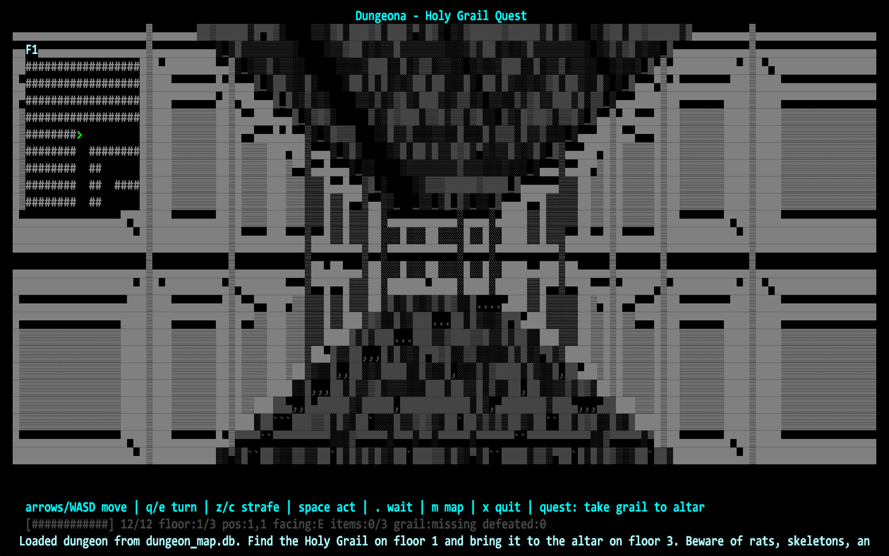
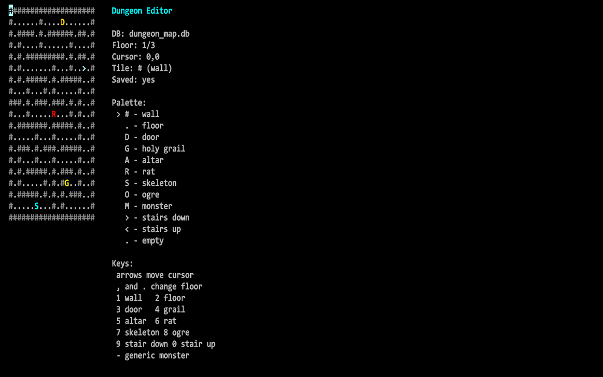
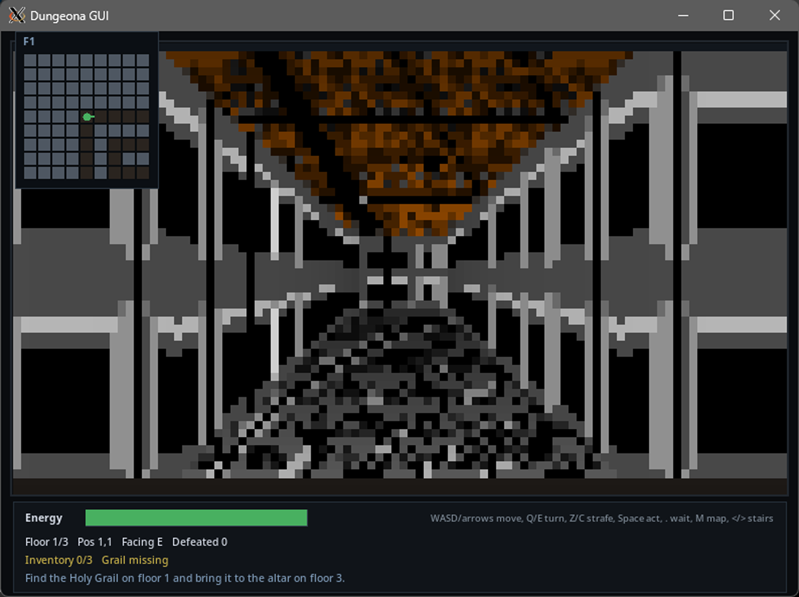
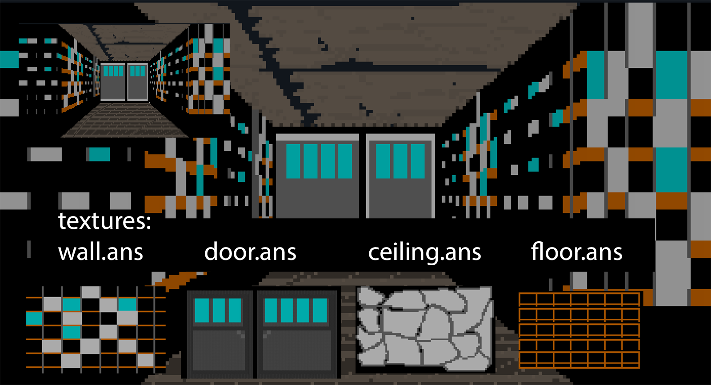
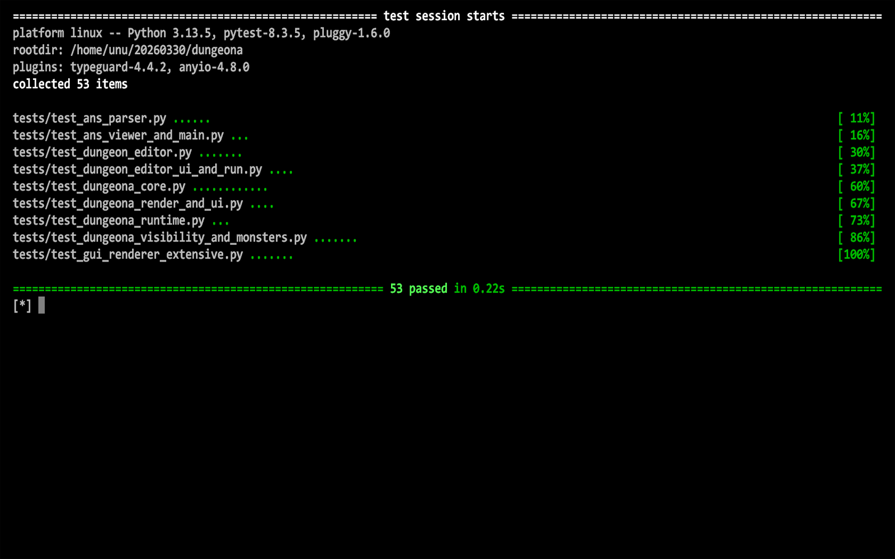

DUNGEONA
========

Version
-------
Updated README for: 20260329_dungeona_019.zip

Overview
--------
Dungeona is a Python-based retro first-person dungeon crawler featuring
terminal and Tkinter frontends, a full dungeon editor, and ANSI texture rendering.

This build expands texture coverage and improves visual consistency across
entities and environments.

What's New in This Build
-----------------------
- Added ANSI textures for:
  - altar
  - grail
  - ogre
  - skeleton
- Expanded monster and object visual rendering
- Continued support for animated rat frames
- Maintains dual Tkinter frontends and terminal gameplay

Project Structure
-----------------
dungeona.py          Terminal (curses) game
dungeona_gui.py      Tkinter GUI frontend
dungeona_ren.py      Alternate Tkinter renderer
dungeon_editor.py    Dungeon editor + validator
ans.py               ANSI parser / viewer
dungeon_map.db       SQLite dungeon storage
textures/            ANSI assets (walls, monsters, items, environment)
license.txt          License
readme.txt           Documentation

Textures Included
-----------------
- wall.ans
- door.ans
- floor.ans
- ceiling.ans
- altar.ans
- grail.ans
- ogre.ans
- skeleton.ans
- rat001-003.ans (animated)

Requirements
------------
- Python 3.10+
- curses (terminal version)
- Tkinter (GUI versions)

Windows:
    pip install windows-curses

How To Run
----------
Terminal version:
    python dungeona.py

GUI version:
    python dungeona_gui.py

Alternate renderer:
    python dungeona_ren.py

Editor:
    python dungeon_editor.py

Gameplay
--------
- Explore a 3-floor dungeon
- Find the Holy Grail
- Deliver it to the altar

Controls
--------
Move: W/A/S/D or arrows
Turn: Q/E
Strafe: Z/C
Interact: Space / Enter
Wait: .
Minimap: M
Stairs: < >
Quit: X

Features
--------
- Energy-based combat system
- Monster pursuit behavior
- Multi-floor dungeon system
- SQLite-backed maps
- Full editor with validation
- ANSI-rendered pseudo-3D visuals
- Animated and static entity textures

Editor Highlights
-----------------
- Multi-floor editing
- Tile placement system
- Full dungeon validation
- Save/load via SQLite

Terminal Settings Note 
----------------------
[.] export TERM=screen-256color # this
[.] python3 dungeona.py --color-mode 256
[.] python3 dungeona.py --color-mode 16

https://asciinema.org/a/zGX38RkA7C9AzoRF

License
-------
Donationware License (see license.txt)

Author
------
mtatton (2026)

Donate
------
https://paypal.me/michtatton
